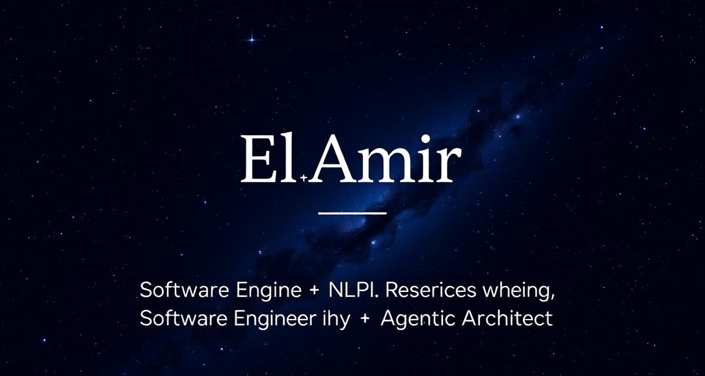

<p align="center">
  
</p>

<h1 align="center">🌌 ElAmir — Interactive Galaxy Portfolio</h1>

<p align="center">
  <strong>An immersive 3D solar-system portfolio</strong> built at the intersection of code, design, and intelligence.
</p>

<p align="center">
  <a href="#features">Features</a> •
  <a href="#tech-stack">Tech Stack</a> •
  <a href="#getting-started">Getting Started</a> •
  <a href="#project-structure">Structure</a> •
  <a href="#architecture">Architecture</a> •
  <a href="#license">License</a>
</p>

---

## ✨ Features

| Feature | Description |
|---------|-------------|
| 🪐 **3D Galaxy Scene** | Interactive solar system with orbiting planets representing expertise domains — built with React Three Fiber, Drei, and post-processing effects (Bloom, Vignette) |
| 🎯 **Smart Camera** | Click a planet and the camera smoothly follows its orbital path in real-time |
| 🔗 **Constellation Lines** | Shared-skill connections rendered as animated lines between related planets |
| ⚡ **Adaptive Performance** | Auto-detects FPS and downgrades effects (DPR, star count, post-processing) across High / Medium / Low tiers |
| 🧠 **NLP Research Sandbox** | Interactive tokenizer, attention heatmap, and sentiment analyzer simulating depression-detection pipelines |
| 🏗️ **Architecture Diagrams** | Mermaid-powered system architecture visualizations inside each project |
| 📱 **Responsive Design** | Desktop gets the full 3D experience; mobile gets a beautifully animated 2D Star Map |
| 🔊 **Spatial Audio** | Procedural ambient drone and UI hover/click sounds via the Web Audio API |
| ✨ **Starfield Background** | Canvas-based twinkling starfield spanning the entire page |
| 🎨 **Cyberpunk-Minimal Aesthetic** | Glassmorphism, neon accents, and seamless dark backgrounds across all sections |
| 📝 **Admin Panel** | Edit all portfolio content (profile, planets, projects, skills) from `/admin` — persisted to localStorage |

## 🛠️ Tech Stack

| Layer | Technologies |
|-------|-------------|
| **Framework** | React 18, TypeScript, Vite |
| **3D Engine** | Three.js, @react-three/fiber, @react-three/drei, @react-three/postprocessing |
| **Styling** | Tailwind CSS, shadcn/ui, Framer Motion |
| **Audio** | Web Audio API (procedural synthesis) |
| **State** | React hooks, TanStack Query |
| **Data** | JSON-driven content layer with admin CMS |
| **Routing** | React Router v6 |

## 🚀 Getting Started

```bash
# Clone the repository
git clone <YOUR_GIT_URL>
cd <YOUR_PROJECT_NAME>

# Install dependencies
npm install

# Start the dev server
npm run dev
```

Open [http://localhost:5173](http://localhost:5173) to explore the galaxy.

## 📁 Project Structure

```
src/
├── components/
│   ├── GalaxyScene.tsx        # Main 3D canvas with planets, sun, orbits, post-processing
│   ├── PlanetModel.tsx        # Individual planet with GLTF support, atmosphere, floating labels
│   ├── CameraController.tsx   # Smooth camera follow / reset logic
│   ├── ConstellationLines.tsx  # Skill-based connection lines between planets
│   ├── Starfield.tsx          # Canvas starfield background
│   ├── SpatialAudio.tsx       # Ambient drone + UI sound effects
│   ├── PlanetDrawer.tsx       # Slide-out detail panel for selected planet
│   ├── StarMap.tsx            # Mobile 2D planet grid
│   ├── NLPSandbox.tsx         # Interactive NLP analysis tool
│   ├── ArchitectureDiagram.tsx # Mermaid diagram renderer
│   ├── Navbar.tsx             # Navigation with smooth scroll
│   ├── AboutSection.tsx       # About + animated counters
│   └── ContactSection.tsx     # Contact form + social links
├── pages/
│   ├── Index.tsx              # Main page orchestrator
│   ├── Admin.tsx              # Content management panel
│   └── NotFound.tsx           # Themed 404 page
├── services/
│   └── DataService.ts         # Data layer with caching + localStorage persistence
└── public/
    └── data/content.json      # Portfolio content (planets, profile, projects)
```

## 🏗️ Architecture

```
┌─────────────────────────────────────────────┐
│                   Index.tsx                  │
│  ┌──────────┐  ┌───────────┐  ┌──────────┐  │
│  │ Starfield│  │  Navbar   │  │  Audio   │  │
│  └──────────┘  └───────────┘  └──────────┘  │
│                                             │
│  ┌─────────────────────────────────────────┐ │
│  │           GalaxyScene (3D)              │ │
│  │  ┌─────┐ ┌────────┐ ┌───────────────┐  │ │
│  │  │ Sun │ │Planets │ │Constellations │  │ │
│  │  └─────┘ └────────┘ └───────────────┘  │ │
│  │  ┌──────────┐ ┌──────────────────────┐  │ │
│  │  │ Camera   │ │  PostFX (Bloom/Vig)  │  │ │
│  │  └──────────┘ └──────────────────────┘  │ │
│  └─────────────────────────────────────────┘ │
│                                             │
│  ┌──────────┐  ┌───────────┐  ┌──────────┐  │
│  │  About   │  │  Contact  │  │ Drawer   │  │
│  └──────────┘  └───────────┘  └──────────┘  │
└─────────────────────────────────────────────┘
        ▲                           ▲
        │    DataService.ts         │
        └──── content.json ─────────┘
```

## 📄 License

© ElAmir. All rights reserved.
